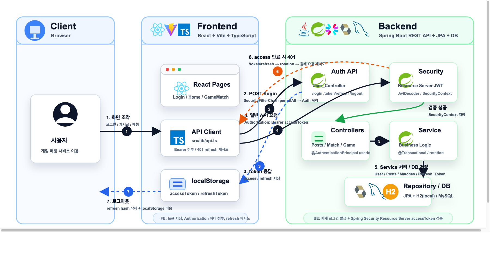
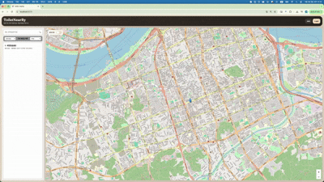
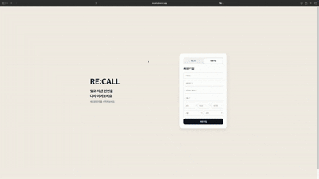

# 최시원

### 사용자 불편을 서비스 구조로 풀어내는 웹 개발자

`Spring Boot` `React` `TypeScript` `Location Service` `Matching` `Service Design`

 

---

## About Me

사용자가 헤매는 시간을 줄이는 서비스를 만드는 데 관심이 있습니다. 
위치 기반 검색, 매칭 흐름, 기록/조회 경험처럼 일상적인 불편을 웹 서비스로 풀어내는 프로젝트를 주로 진행했습니다.

백엔드에서는 `Spring Boot`, `Spring Security`, `JPA`, `JWT`, `DB 설계`를 중심으로 안정적인 API 구조를 고민했고, 프론트엔드에서는 `React`와 `TypeScript`로 사용자가 바로 이해할 수 있는 흐름을 구현했습니다.

---

## Projects

<table>
  <tr>
    <td width="62%" valign="top">
      <h3>Game_Match</h3>
      
친선 매칭을 제공하는 게임 커뮤니티 플랫폼입니다. 매칭 신청, 팀원 등록, 사용자 인증, 게시글 흐름을 하나의 서비스 구조로 설계했습니다.

      
<b>Core</b>

      <ul>
        <li>도메인별 책임 분리와 서비스 레이어 중심 구조 설계</li>
        <li>대량 테스트 데이터 기반 쿼리 성능 검증</li>
        <li>매칭 상태 정합성을 위한 트랜잭션/제약 조건 고려</li>
        <li>만료 매칭 처리를 Spring Batch Job으로 고도화</li>
      </ul>
      
<b>Stack</b> <code>React</code> <code>Vite</code> <code>TypeScript</code> <code>Java</code> <code>Spring Boot</code> <code>Spring Security</code> <code>JPA</code> <code>MySQL</code>

      

        <a href="https://github.com/Siwon-Choi/game-match-frontend">Frontend</a>
        ·
        <a href="https://github.com/Siwon-Choi/game-match-backend">Backend</a>
      

    </td>
    <td width="38%" valign="top">
      
    </td>
  </tr>
  <tr>
    <td width="62%" valign="top">
      <h3>Toilet_NearBy</h3>
      
현재 위치 기반으로 주변 공중화장실을 찾고, 후기/평점/비밀번호 정보를 공유하는 커뮤니티형 위치 서비스입니다.

      
<b>Core</b>

      <ul>
        <li>REST API와 위치 기반 검색 기능 설계</li>
        <li>Bounding Box 후보군 조회로 검색 범위 축소</li>
        <li>좌표 복합 인덱스와 격자 기반 Caffeine Cache 적용</li>
        <li>Spring Security/JWT 기반 인증 흐름 구현</li>
      </ul>
      
<b>Stack</b> <code>React</code> <code>TypeScript</code> <code>Leaflet</code> <code>Java</code> <code>Spring Boot</code> <code>Spring Security</code> <code>JPA</code> <code>PostgreSQL</code>

      

        <a href="https://github.com/Siwon-Choi/ToiletNearBy_FE">Frontend</a>
        ·
        <a href="https://github.com/Siwon-Choi/ToiletNearBy_BE">Backend</a>
      

    </td>
    <td width="38%" valign="top">
      
    </td>
  </tr>
  <tr>
    <td width="62%" valign="top">
      <h3>Recall</h3>
      
동창생을 검색하고 다시 연결될 수 있도록 돕는 웹 서비스입니다. 팀장으로 프로젝트 방향을 조율하고 프론트엔드 개발을 담당했습니다.

      
<b>Core</b>

      <ul>
        <li>React/TypeScript 기반 검색 UI와 정보 조회 흐름 구현</li>
        <li>프론트엔드와 백엔드 REST API 연결 구조 설계</li>
        <li>Spring 기반 서버 일부 기능 개발 참여</li>
        <li>Vercel 배포와 팀 역할 분담/일정 조율 경험</li>
      </ul>
      
<b>Stack</b> <code>React</code> <code>TypeScript</code> <code>Spring</code> <code>REST API</code> <code>AWS EC2</code> <code>Vercel</code>

      
<a href="https://auto-ever-project-1.vercel.app/">Portfolio</a>

    </td>
    <td width="38%" valign="top">
      
    </td>
  </tr>
</table>

---

## Core Experience

<table>
  <tr>
    <td width="28%" valign="top"><b>위치 기반 검색 최적화</b> Toilet_NearBy</td>
    <td>Bounding Box 후보군 조회, 좌표 복합 인덱스, 격자 기반 캐싱을 적용해 현재 위치 기반 검색의 반복 조회 비용을 줄이는 방향을 고민했습니다.</td>
  </tr>
  <tr>
    <td width="28%" valign="top"><b>인증/보안 흐름 설계</b> Game_Match · Toilet_NearBy</td>
    <td>Spring Security와 JWT 기반 인증을 구현하고, access token 검증, refresh token 재발급, 보호 API 접근 흐름을 서비스 구조에 맞게 설계했습니다.</td>
  </tr>
  <tr>
    <td width="28%" valign="top"><b>데이터 정합성 관리</b> Game_Match</td>
    <td>매칭 신청, 팀원 등록, 만료 상태 처리처럼 상태 변화가 많은 기능에서 트랜잭션과 제약 조건을 고려해 안정적인 데이터 흐름을 만들었습니다.</td>
  </tr>
  <tr>
    <td width="28%" valign="top"><b>서비스 전체 흐름 경험</b> Portfolio · Recall</td>
    <td>기획, UI 구현, API 연동, 배포까지 이어지는 웹 서비스 흐름을 경험했고, 팀 프로젝트에서는 역할 분담과 일정 조율을 함께 맡았습니다.</td>
  </tr>
</table>

---

## Main Tech

### Languages

### Frontend

### Backend

### Database & Infra

### Test & Data

---

## Problem Solving

  

---

## GitHub

  
  

